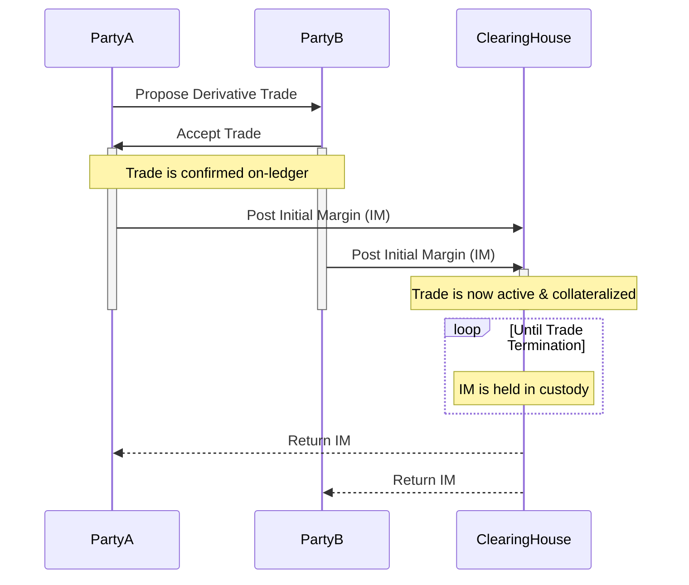
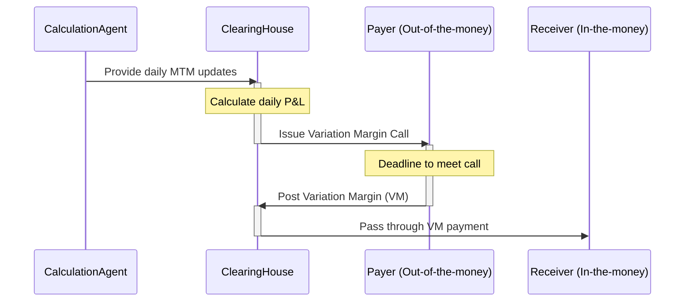

# OTC Derivatives Clearing Model

This document outlines the risk management and clearing model for the Canton-based OTC derivatives platform. The model is designed to mitigate counterparty credit risk through a robust margin and default management framework, implemented using Daml smart contracts.

## Key Participants

*   **Trading Parties:** Two entities entering into a bilateral derivative contract.
*   **Clearing House:** A neutral, central counterparty (CCP) role responsible for margin management, trade lifecycle events, and default management. In our model, this is represented by a central Daml contract.
*   **Calculation Agent:** A trusted party responsible for providing daily Mark-to-Market (MTM) values for trades. This could be the Clearing House or a designated third-party data provider.

---

## 1. Initial Margin (IM)

### Purpose
Initial Margin is collateral posted by both trading parties at the inception of a trade. Its purpose is to cover potential future exposure (PFE) that could arise from changes in the derivative's value between the last margin settlement and the close-out of positions in the event of a counterparty default.

### Process Flow
1.  **Agreement:** Two parties agree on the terms of a derivative trade (e.g., an Interest Rate Swap) off-ledger or via a pre-trade workflow.
2.  **Trade Confirmation:** The trade is confirmed on-ledger by creating a `Trade` contract, proposed by one party and accepted by the other.
3.  **IM Calculation:** The required IM is calculated based on a predefined schedule (e.g., a fixed percentage of the notional amount).
4.  **IM Posting:** Upon trade acceptance, both parties are required to post their respective IM to the central `ClearingHouse` contract. This is typically done using an on-ledger tokenized cash asset. The trade only becomes fully active once both parties have posted their IM.
5.  **Custody:** The `ClearingHouse` contract holds the IM from both parties in segregated accounts for the life of the trade.
6.  **Return:** IM is returned to the respective parties upon the successful termination of the trade (e.g., at maturity or through an agreed-upon early termination).



---

## 2. Variation Margin (VM)

### Purpose
Variation Margin is exchanged daily to settle the day-over-day change in the Mark-to-Market (MTM) value of the derivative contract. This prevents the accumulation of large unrealized gains and losses, keeping the net exposure between counterparties close to zero.

### Process Flow
1.  **MTM Calculation:** At a predetermined time each day (e.g., 16:00 UTC), the Calculation Agent determines the current MTM value for every active trade.
2.  **Margin Call Issuance:**
    *   The `ClearingHouse` contract compares the new MTM with the previous day's MTM.
    *   The party whose position has lost value (the "out-of-the-money" party) is issued a `MarginCall` contract.
    *   The `MarginCall` specifies the amount of VM required to cover the loss.
3.  **VM Settlement:**
    *   The out-of-the-money party must settle the margin call within a specified timeframe (e.g., by 10:00 UTC the next day).
    *   Settlement is performed by transferring the required amount of an eligible cash token to the `ClearingHouse` contract.
4.  **VM Passthrough:** Upon receiving the VM, the `ClearingHouse` immediately passes the funds through to the "in-the-money" party, whose position has gained value.

This daily cycle ensures that profits and losses are realized and settled, preventing the build-up of credit exposure.



---

## 3. Default Management Waterfall

The default management waterfall is a predefined sequence of actions taken by the Clearing House when a trading party fails to meet its obligations, primarily failing to settle a variation margin call. The goal is to contain the impact of the default and protect the non-defaulting members and the clearing system itself.

### The Waterfall Steps

1.  **Grace Period & Notification:**
    *   If a party fails to meet a margin call by the deadline, a grace period begins.
    *   The `ClearingHouse` contract notifies both the failing party and its own operators.
2.  **Declaration of Default:**
    *   If the margin call is not met by the end of the grace period, the `ClearingHouse` formally declares the party in default. This is an irreversible action on the ledger that freezes the defaulting party's ability to enter new trades.
3.  **Position Close-Out and Netting:**
    *   The `ClearingHouse` immediately terminates (closes out) all active trades with the defaulting party.
    *   The MTM value of all closed-out positions is calculated to determine a single, net close-out amount owed to or by the defaulter.
4.  **Application of Defaulter's Resources:**
    *   **Initial Margin:** The `ClearingHouse` seizes the defaulting party's Initial Margin and applies it to cover the net loss.
5.  **Application of Clearing House Resources (Skin-in-the-Game):**
    *   If the defaulter's IM is insufficient to cover the loss, the `ClearingHouse` contributes a portion of its own capital. This pre-committed fund demonstrates the Clearing House's incentive to manage risk effectively.
6.  **Application of Default Fund Contributions:**
    *   If a loss still remains, the `ClearingHouse` draws from the Default Fund. This fund is a pool of capital pre-funded by all non-defaulting trading members. This step mutualizes the remaining risk across the surviving members. Contributions are typically proportional to the members' trading activity.
7.  **Recovery and Assessment:**
    *   If the Default Fund is depleted and losses still remain (a scenario indicative of extreme market stress), the Clearing House may take further action, such as haircutting survivors' IM or conducting an auction of the defaulted portfolio. Such extreme measures are outside the initial scope but the framework allows for their future implementation.
    *   Any surplus remaining after covering all losses is returned to the hierarchy in reverse order.

```mermaid
graph TD
    A[Failure to Meet Margin Call] --> B{Grace Period Ends};
    B --> C[Declare Party in Default];
    C --> D[Close-Out All Defaulter Trades];
    D --> E[Calculate Net Loss];
    E --> F{Apply Defaulter's Initial Margin};
    F -- Insufficient --> G{Apply Clearing House Capital (Skin-in-the-Game)};
    F -- Sufficient --> L[Loss Covered];
    G -- Insufficient --> H{Draw from Default Fund (Survivors' Contributions)};
    G -- Sufficient --> L;
    H -- Insufficient --> I[Extreme Measures: Portfolio Auction / Further Assessment];
    H -- Sufficient --> L;
    I --> L;
    L --> M[Default Resolution Complete];
```

This structured waterfall, enforced by the Daml smart contract logic, ensures a predictable, transparent, and automated process for handling counterparty defaults, thereby maintaining the stability and integrity of the clearing system.